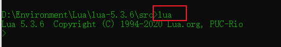
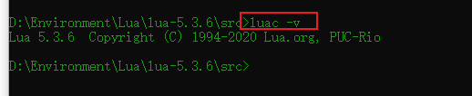
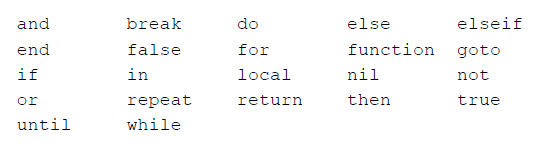
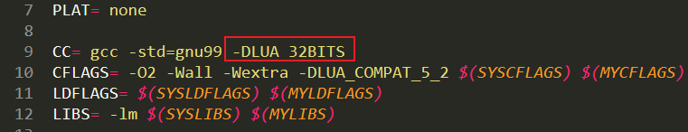
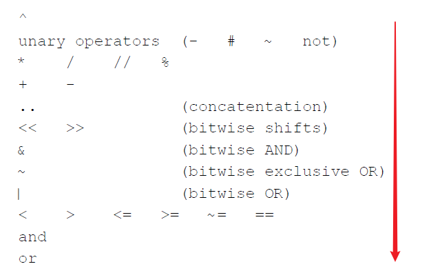
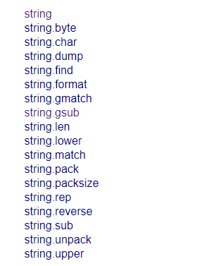

# Lua笔记


# 1、概述

Lua 是一个小巧的脚本语言。

它是巴西里约热内卢天主教大学（Pontifical Catholic University of Rio de Janeiro）里的一个由 Roberto Ierusalimschy、Waldemar Celes 和 Luiz Henrique de Figueiredo 三人所组成的研究小组于1993年开发的。

 其**设计目的**是为了通过灵活嵌入应用程序中从而为应用程序提供灵活的扩展和定制功能。

Lua 由标准 C 编写而成，几乎在所有操作系统和平台上都可以编译，运行。Lua 并没有提供强大的库，这是由它的定位决定的。

Lua 不适合作为开发独立应用程序的语言。

Lua 有一个同时进行的 JIT 项目，提供在特定平台上的即时编译功能。

一个完整的 Lua 解释器不过200k，在所有脚本引擎中，Lua 的速度是最快的。这一切都决定了 Lua 是作为嵌入式脚本的最佳选择。

# 2、安装

官网：http://www.lua.org/

Windows 平台：

- https://joedf.ahkscript.org/LuaBuilds/

- https://github.com/joedf/LuaBuilds/tree/gh-pages/PrivateBuild/builds

下载版本：5.3.6

## 2.1 编译步骤

1、解压

2、进入文件夹根目录

3、编译

```bash
make posix
```

4、编译好的文件 `lua`，`luac` 在 `src` 目录

5、在命令行模式下进入 `src` 文件夹，输入 `lua` 进入交互模式



6、同时可以输入 `luac -v` 查看版本



## 2.2 入门程序

简单的程序：

```lua
print("Hello World!")
```


# 3、基本语法

（1）变量默认都是全局变量，除非用 `local` 显式声明为局部变量

（2）命名规则：不能以数字开头，避免 `_VERSION` 这种，这种形式有特殊用途

（3）关键字（保留字）



（4）大小写敏感（`a` 和 `A` 不一样）

（5）注释

- 单行注释：`--`（两个连字符）
- 多行注释：`--[[我的注释]]`

（6）分号的问题：加不加分号都行

（7）变量的类型自动确定

（8）逻辑运算符：`and, or, not` 

（9）字符串连接用`..`（两个点）

（10）字符串用单引号、双引号都行


# 4、控制语句

## do-end块

```lua
do
  ...
end
```


可以在内部定义局部变量，避免污染命名空间（名字空间）

## 条件

### if 条件句

```lua
if ... then 
  ...
end
```

```lua
if ... then
  ...
else
  ...
end
```

```lua
if ... then
  ...
elseif ... then
  ...
else
  ...
end
```


Lua认为false和nil为假，true和非nil为真

## 循环

### while 循环

```lua
while 条件 do
  ...
end
```

### for 循环

```lua
for var = exp1, exp2, exp3 do
	something
end
```

表达式3是步长，可选的，如果没有默认步长是1

如果我们想要一个没有上限的循环，我们可以使用常数 `math.huge`

注意点：三个表达式在循环体执行之前都被计算出来，而且只计算一次，控制默认是局部变量

### repeat–until 循环

```lua
repeat
  循环体
until 条件句
```

注意点：

在循环体内部声明的变量默认是全局变量

循环体中的局部变量在条件判断句中是可以用的

### break，return，goto 语句

```lua
goto Label
:: Label ::
```


# 5、基本数据类型

八种基本类型：**nil, boolean, number, string, userdata, function, thread,  table**

查看类型：`type`函数：返回值是字符串类型

```bash
type(nil) # nil
type(true) # boolean
type(10) # number
type("Hello") # string
type(io.stdin) # userdata
type(print) # function
type({}) # table
type(type(x)) # string
```

变量的数据类型不是固定不变的，可以一会是 `string`，一会是 `number`

## Nil

Lua 使用 `nil`代表这个变量没有一般意义上的值

在全局变量未赋值之前，默认是 `nil`，同时如果把 `nil` 赋值给某个全局变量，相当于删除这个全局变量

## Boolean

只有对和错，`true` 和 `false`

在条件句，只有 `false` 和 `nil` 是假，其他都是真，0 和空字符串也是真

`and`、`or` 和  `not`

- 与操作和或操作都是短路的（short circuit）
- 与操作，如果第一个条件是错的，肯定是错的
- 或操作，就是第一个条件是对的，肯定是对的
- 如果是操作数，与操作，如果第一个操作数是 `false`，结果就是第一个操作数的值，否则是第二个
- 如果是操作数，或操作，如果第一个操作数是 `true`，结果就是第一个操作数的值，否则是第二个

几个有用的等价

|                                        | 等价于                                           |
| -------------------------------------- | ------------------------------------------------ |
| `x = x or v`                           | `if not x then x = v end`（为空则赋值）          |
| `a and b or c` （这里 b 不能是 false） | `a ? b : c`（这是个 C 的三元运算符，Lua 不支持） |
| 找两个数的较大者 `(x > y) and x or y`  | `(x > y) ? x : y`                                |

## Number

### 基本概念

5.3 版本之前，所有的数字都是双精度浮点数。

Lua5.3 开始，有了两种选择，64 位整数（integer）和双精度浮点数（float）

【注意】Lua 中 `float` 不是单精度浮点数，是双精度的

> 可以使用`-DLUA_32BITS`编译32位整数的 Lua 版本
>
> 修改 src 目录下得 makefile文件
>
> 
>
> 只有整数位数不同，其他都一样

数字和 C 基本一样，可以带指数

```lua
4e34
```

带小数点的、带指数的都是浮点数

相同的值，整数和小数比较，结果是 `true`

```lua
> print(3.0 == 3)
true
```

十六进制的数可以带 2 的指数幂（后面跟 p）

```lua
> print(0x7p2)
28.0
> print(0x3P-2)
0.75
```

另外一种形式： `string.format` 函数，`%a`

```lua
> a = string.format("%a", 56789)
> a
0x1.bbaap+15
```

### 基本运算

（1）加减乘除非，取整、取模、幂运算（`^`）

（2）int 和 int 运算，结果还是 int，其他都是 float（除法不适用这个规则）

```lua
> 1+1
2
> 1+2.0
3.0
```

（3）除法、幂运算永远是浮点数，可以认为运算之前，除数被自动转换为浮点数

```lua
> 3 / 2
1.5
> 3 / 3
1.0
> 2^3^2 -- 会先计算后面
512.0
> 2^(3^2)
512.0
```

（4）C 语言中那种除法（取整），用 `//`，这种运算适用第二点的规则

```lua
> 3 // 2
1
> math.type(3 // 2)
integer
```

（5）取模运算结果的符号和第二个操作数的符号相同

```lua
> 3 // 2
1
> math.type(3 // 2)
integer
```

（6）浮点数可以使用取模运算达到保留指定小数位数的结果

```lua
> 3.14 - 3.14 % 0.1
3.1
> 3 // 2
1
> math.type(3 // 2)
integer
```

### 关系运算符

`> < >= <= == ~=`

### 有关函数和常量

`math.random`

（1）不给参数，范围[0，1）

（2）给个整数 N，返回范围在[1，N]

（3）给两个整数 M 和 N，结果就在 [M，N] 之间

```lua
> 3 // 2
1
> math.type(3 // 2)
integer
```

（4）可以给个种子 `math.randomseed(os.time())`

`math.maxinteger` 和 `math.mininteger`

``math.huge`：浮点数的最大值（10^308）

### 强制转换

（1）浮点数和 0 进行或运算可以强转为整数（不能超过整数范围，不能有小数部分），`math.tointeger`：不能转换的时候返回空

（2）整数和 0.0 做加法可以转为浮点数

```lua
> print(1)
1
> print(1 + 0.0)
1.0
> print(32.0)
32.0
> print(32.0 | 0)
32
> print(32.1 | 0)
stdin:1: number has no integer representation
stack traceback:
        stdin:1: in main chunk
        [C]: in ?
> print(math.tointeger(32.1)
>> )
nil
> print(math.tointeger(32.0))
32
```

### 运算符优先级




## String

不可变

长度运算符 `#`

字符串连接符 `..`

非常长的跨行字符串 `[[]]`

### 数字和字符串互相转换

转换是在运行时完成的

函数：

- `tonumber`，如果字符串不合法，返回空；可以指定进制（基在 2~36 之间）
- `tostring`

### 字符串库

len(s)

rep(s, n)：创建一个重复 n 次 s 的字符串

reverse：翻转

lower/upper：转小写/大写

sub(s, i,  j)：闭区间，可以使用负数

char：返回数字的内部表示，支持多个参数

byte(字符串，位置)：返回指定位置数字的内部表示，默认第一个；可以指定多个位置

format：格式化字符串

find：查找指定的字串

gsub：用指定的串替换不想要的串





可以使用冒号运算符操作这些库 

```lua
string.sub(s, i, j)  --> s:sub(i, j)
```

## Table

最强大的数据类型

可以当做数组、集合等其他数据结构来使用

### 初始化

```lua
> a = {}
> b = {x = "aa", "bb", "cc"}
```

### 索引

索引可以是整数、浮点数、字符串等

```lua
> a[100] = 12
> a[100]
12
> a["x"] = 10
> a["x"]
10
> a[2.1] = 23
> a[2.1]
23
```


### 浅拷贝

```lua
> c = a
> c[100] = 100
> a[100]
100
```


### 语法糖

```tex
a.x --> a["x"]

> a.x == a[x]
false
> a.x == a["x"]
true
```


### 遍历

```lua
> for k, v in pairs(b) do print(k, v) end # k, v的形式
1       aa
2       bb
3       cc

> for k, v in pairs(a) do print(k, v) end
100     100
2.1     23
x       10

> for k, v in ipairs(b) do print(k, v) end # list 形式
1       aa
2       bb
3       cc

> for k=1, #b do print(k, b[k]) end# sequence
1       aa
2       bb
3       cc
```

对于 list 形式的表，用 pairs 和 ipairs

一般的表，用 pairs

 k, v 形式的遍历：

- 如果是 list，是顺序遍历
- 如果一般的，是随机顺序


### 有关函数

模拟栈操作

```lua
> table.insert(b, "123")
>  for k=1, #b do print(k, b[k]) end
1       aa
2       bb
3       cc
4       123
> table.remove(b)
123
>  for k=1, #b do print(k, b[k]) end
1       aa
2       bb
3       cc
```


# 6、函数

语法糖：`:`，形如` o:foo(x)`的表达式意为调用对象 o 的 foo 方法

特点：

- 既可以调用Lua语言编写的函数，也可以调用C语言（或者宿主程序使用的其他任意语言）编写的函数
- 调用函数时使用的参数个数可以与定义函数时使用的参数个数不一致
  - 通过抛弃多余参数和将不足的参数设为 `nil` 的方式来调整参数的个数
- 允许一个函数返回多个结果,，在 `return` 关键字后列出所有要返回的值即可
  - 被作为一条单独语句调用时，其所有返回值都会被丢弃
  - 被作为表达式（例如，加法的操作数）调用时，将只保留函数的第一个返回值
  - 一系列表达式中的最后一个表达式（或是唯一一个表达式）时，其所有的返回值都能被获取到
- 当一个函数调用是另一个函数调用的最后一个（或者是唯一）实参时，第一个函数的所有返回值都会被作为实参传给第二个函数（如 `print` 函数）
- 表构造器会完整地接收函数调用的所有返回值，而不会调整返回值的个数
  - 只有当函数调用是表达式列表中的最后一个时才有效，在其他位置上的函数调用总是只返回一个结果
  - 将函数调用用一对圆括号括起来可以强制其只返回一个结果
- 参数可变
  - `...`三个点表示函数的参数是可变的，必须放在最后
  - 访问这些参数时仍需用到三个点，但不同的是此时这三个点是作为一个表达式来使用的，可以用 `{...}  `封装成列表，之后可以使用 for 循环取数据，也可以直接赋值，如 `local a, b = ...`


