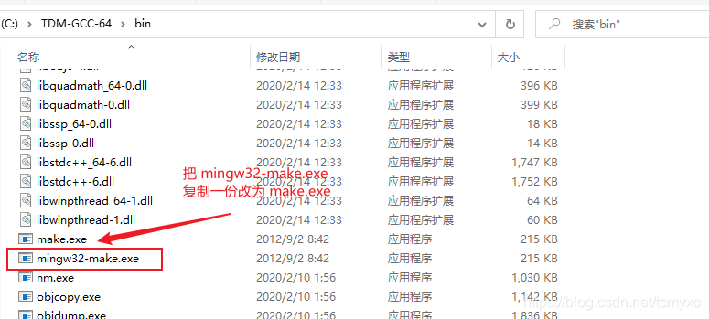
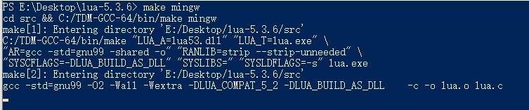

# Lua编译

[TOC]

# 一、环境以及安装包
## 1.1 环境以及安装包

- gcc 编译环境（本人选择TDM-GCC9.2.0，[下载链接](https://jmeubank.github.io/tdm-gcc/)）
- Lua 源代码（本人选择 [lua-5.3.6](http://www.lua.org/ftp/)）

## 1.2 安装前的准备工作

- 将 TDM-GCC 的 bin 目录添加到环境变量
- 进入 TDM-GCC 的 bin 目录，将 `把 mingw32-make.exe` 复制一份并修改为改为 `make.exe`，如下图：

- 验证 GCC 环境，输出如下

```bash
>gcc -v
Using built-in specs.
COLLECT_GCC=gcc
COLLECT_LTO_WRAPPER=C:/TDM-GCC-64/bin/../libexec/gcc/x86_64-w64-mingw32/9.2.0/lto-wrapper.exe
Target: x86_64-w64-mingw32
Configured with: ../../../src/gcc-git-9.2.0/configure --build=x86_64-w64-mingw32 --enable-targets=all --enable-languages=ada,c,c++,fortran,lto,objc,obj-c++ --enable-libgomp --enable-lto --enable-graphite --enable-cxx-flags=-DWINPTHREAD_STATIC --disable-build-with-cxx --disable-build-poststage1-with-cxx --enable-libstdcxx-debug --enable-threads=posix --enable-version-specific-runtime-libs --enable-fully-dynamic-string --enable-libstdcxx-threads --enable-libstdcxx-time --with-gnu-ld --disable-werror --disable-nls --disable-win32-registry --enable-large-address-aware --disable-rpath --disable-symvers --prefix=/mingw64tdm --with-local-prefix=/mingw64tdm --with-pkgversion=tdm64-1 --with-bugurl=http://tdm-gcc.tdragon.net/bugs
Thread model: posix
gcc version 9.2.0 (tdm64-1)

>g++ -v
Using built-in specs.
COLLECT_GCC=g++
COLLECT_LTO_WRAPPER=C:/TDM-GCC-64/bin/../libexec/gcc/x86_64-w64-mingw32/9.2.0/lto-wrapper.exe
Target: x86_64-w64-mingw32
Configured with: ../../../src/gcc-git-9.2.0/configure --build=x86_64-w64-mingw32 --enable-targets=all --enable-languages=ada,c,c++,fortran,lto,objc,obj-c++ --enable-libgomp --enable-lto --enable-graphite --enable-cxx-flags=-DWINPTHREAD_STATIC --disable-build-with-cxx --disable-build-poststage1-with-cxx --enable-libstdcxx-debug --enable-threads=posix --enable-version-specific-runtime-libs --enable-fully-dynamic-string --enable-libstdcxx-threads --enable-libstdcxx-time --with-gnu-ld --disable-werror --disable-nls --disable-win32-registry --enable-large-address-aware --disable-rpath --disable-symvers --prefix=/mingw64tdm --with-local-prefix=/mingw64tdm --with-pkgversion=tdm64-1 --with-bugurl=http://tdm-gcc.tdragon.net/bugs
Thread model: posix
gcc version 9.2.0 (tdm64-1)

>make -v
GNU Make 3.82.90
Built for i686-pc-mingw32
Copyright (C) 1988-2012 Free Software Foundation, Inc.
License GPLv3+: GNU GPL version 3 or later <http://gnu.org/licenses/gpl.html>
This is free software: you are free to change and redistribute it.
There is NO WARRANTY, to the extent permitted by law.
```

# 二、编译
- 将下载的源代码解压
- 进入源代码根目录，也就是 `lua-5.3.6` 目录下
- 按住 `shift` 键的同时点击鼠标右键，选择 `在此处打开 PowerShell 窗口`
- 输入 `make mingw`



- 编译完成，生成的目标文件共有三个 `lua.exe`，`luac.exe`，`lua53.dll`，在 `src` 目录下


- 可以直接将 `src` 添加到环境变量，或者将上述三个文件保存在某个目录，然后将这个目录添加到环境变量
- 验证，在命令行窗口输入 `lua`，或者输入 `lua -v`


# 三、结语
我们通过有关的环境变量配置即可自己手动编译一个自己的 Lua 环境，但是这里也有一个注意点，本人在 `TDM-GCC` 以及 `Mingw` 的 GCC 编译环境下编译出来的不需要再依赖其他的库，但是在 `cygwin64` 平台下编译的 Lua 解释器还需要依赖 `cygwin64` 的有关库（也就是说编译好的文件不能共享给其他人使用）

# 四、参考文献
- [1] Lua 官方文档
- [2] https://github.com/joedf/LuaBuilds 